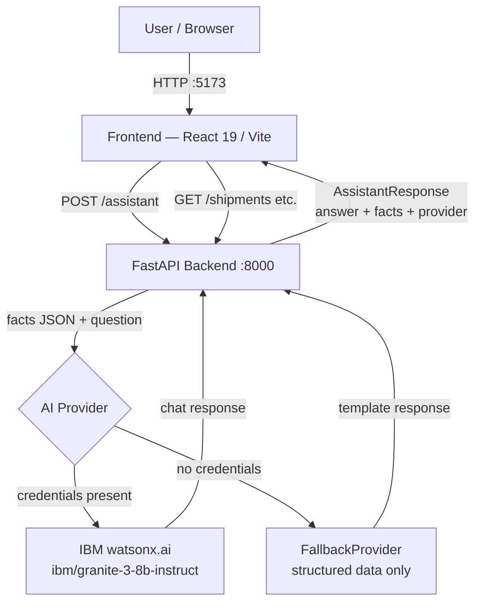

# Architecture

## System Architecture

## Components

| Component | Technology | Responsibility |
|---|---|---|
| Frontend Dashboard | React 19, Vite 8 | Disruption monitoring UI, shipment risk table, fleet panel, What-If simulation, AssistantPanel chat |
| Backend API | FastAPI 0.141, Uvicorn, Pydantic v2 | All business logic, deterministic computations, `/assistant` orchestration |
| AI Orchestration | `assistant.py` — `_gather_facts()` + `SYSTEM_PROMPT` | Maps natural-language questions to structured backend facts; passes them to the AI provider |
| AI Provider (live) | `ibm-watsonx-ai` SDK → `ibm/granite-3-8b-instruct` | Generates grounded natural-language answers from structured context |
| AI Provider (fallback) | `FallbackProvider` (no external dependency) | Returns the structured facts and a configuration message when watsonx credentials are absent |
| Environment config | `python-dotenv`, `src/.env` | Loads `WATSONX_API_KEY`, `WATSONX_PROJECT_ID`, `WATSONX_URL`, `WATSONX_MODEL_ID` at startup |

## Data Flow

### Dashboard (read path)

1. The React app renders with hardcoded data matching the backend's in-memory datasets (3 shipments, 2 disruptions, 4 fleet assets).
2. In production this would be replaced by `fetch()` calls to `/shipments`, `/disruptions`, `/fleet`.

### What-If Simulation

1. User clicks "Run Simulation" on the dashboard.
2. Frontend calls `GET /simulate-disruption/DISR-001?additional_hours=48`.
3. Backend identifies all shipments whose origin or destination matches "rotterdam", classifies cold-chain exposure, sums cargo value, and applies the risk escalation rule: `additional_hours >= 48 AND cold_chain_shipments` → **Critical**.
4. Result: 1 impacted shipment (SHIP-001 Vaccines), 1 cold-chain shipment, $520,000 at risk, projected risk: Critical.
5. Frontend displays the computed values.

### AI Assistant

1. User types a question (or clicks a suggested question chip) in the AssistantPanel.
2. `POST /assistant` is called with `{ "question": "..." }`.
3. `_gather_facts(question)` runs regex intent detection against the question:
   - Disruption keywords → `_simulate_disruption()` result added to `facts["simulation"]`
   - Risk keywords → shipments sorted by risk added to `facts["shipments_by_risk"]`
   - Fleet keywords → `_fleet_recommendation()` result added to `facts["fleet_recommendation"]`
   - Always → summary counts added to `facts["summary"]`
4. `facts` is serialised as JSON and injected into the user message alongside the original question.
5. The selected `AIProvider.generate(system_prompt, user_message)` is called.
6. Response is returned as `{ "answer": "...", "facts": {...}, "provider": "WatsonxProvider" }`.
7. Frontend renders the answer, a provider badge (if watsonx), and a collapsible JSON block of the facts.

### Fleet Recommendation

1. Call `GET /fleet-recommendation/{shipment_id}` (or ask the assistant).
2. Backend filters fleet assets: `available=True`, `capacity_tons >= 15`, and `refrigerated=True` if the shipment requires cold chain.
3. Sorts by: (1) whether asset is already at the shipment's destination, (2) lowest utilisation.
4. Returns the top candidate with reason text.

## API Endpoints

| Method | Path | Description |
|---|---|---|
| `GET` | `/` | Health check |
| `GET` | `/health` | Service health |
| `GET` | `/shipments` | All shipments |
| `GET` | `/disruptions` | All disruptions |
| `GET` | `/impacted-shipments/{disruption_id}` | Shipments affected by a disruption |
| `GET` | `/cold-chain-risk/{shipment_id}` | Cold-chain temperature risk for a shipment |
| `GET` | `/fleet` | All fleet assets |
| `GET` | `/fleet-recommendation/{shipment_id}` | Best fleet asset for a shipment |
| `GET` | `/simulate-disruption/{disruption_id}` | What-if disruption extension (`?additional_hours=48`) |
| `POST` | `/assistant` | Natural-language Q&A (`{ "question": "..." }`) |

## Security Considerations

- All secrets (`WATSONX_API_KEY`, `WATSONX_PROJECT_ID`) are stored in environment variables and loaded via `python-dotenv`. They are never committed to git (`.env` is in `.gitignore`).
- `.env.example` contains only placeholder values (`your_ibm_cloud_api_key_here`) — no real credentials.
- CORS is restricted to known frontend origins (`localhost:5173`, `localhost:3000`) — not open to `*`.
- No authentication is implemented on the API endpoints (hackathon scope).

## Scalability Notes

The FastAPI backend is stateless and could be horizontally scaled behind a load balancer — all data is computed in-memory from static datasets.

Moving to a production-grade system would involve:
- Replacing the in-memory datasets with a PostgreSQL database (schema: shipments, disruptions, fleet_assets, telemetry).
- Replacing the fixed cold-chain temperature with a live IoT sensor feed.
- Adding API key authentication on all routes.
- Rate-limiting the `/assistant` endpoint to manage watsonx.ai token costs.
- The watsonx.ai calls are the primary external latency source; they could be cached for identical questions within a short TTL.
